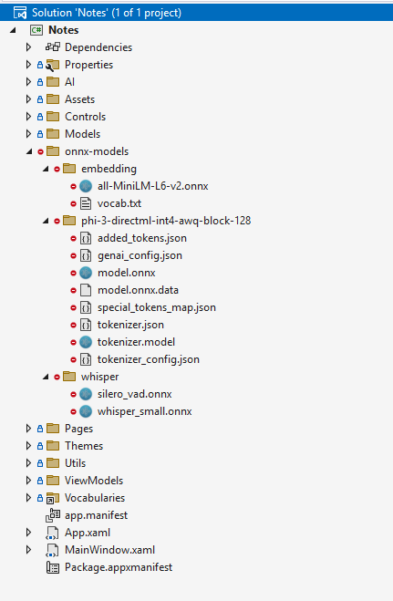

# AI Powered Notes app [Sample]

This sample is a simple note taking app that uses local APIs and models to provide AI powered features. The app is built using WinUI3.

## Set Up

You will need to have Visual Studio installed with the latest workloads for WinAppSDK and WinUI 3 development. You can find instructions on how to set up your environment [here.](https://learn.microsoft.com/en-us/windows/apps/windows-app-sdk/set-up-your-development-environment?tabs=cs-vs-community%2Ccpp-vs-community%2Cvs-2022-17-1-a%2Cvs-2022-17-1-b#install-visual-studio)

Clone the repository and open the solution in Visual Studio. Before you can get started exploring the sample, you will need to download the ML model files required for the project and place them in the `onnx-models` folder.

The final folder structure should look like this:



## Downloading Phi3

The model can be downloaded from the following link:
- https://huggingface.co/microsoft/Phi-3-mini-4k-instruct-onnx

Huggingface models are in repositories which you can clone to get the model files. Clone the Phi3 model repository and copy the required files to this project.

Phi-3-mini-4k-instruct-onnx has 3 different versions inside it's repo. We are using the DirectML versions in this project. Copy the contents of the `directml/directml-int4-awq-block-128` folder to a new folder called `phi-3-directml-int4-awq-block-128` under `onnx-models` folder.

## Downloading all-MiniLM-L6-v2 
The model can be downloaded from the following link:
- https://huggingface.co/optimum/all-MiniLM-L6-v2

This is model we use for semantic search. The two files you will need are `model.onnx` and `vocab.txt`. Create a new folder under `onnx-models` called `embedding` and place the files there. Rename `model.onnx` to `all-MiniLM-L6-v2.onnx`.

## Downloading Sliero VAD
The Sliero Voice Activity Detection model can be downloaded from the following link:
- https://github.com/snakers4/silero-vad 

This is the model we use for smart chunking of audio and the only file you will need is the `/files/sliero_vad.onnx` file. 

This should also be placed under a new folder called `whisper` under the `onnx-models` folder.

## Downloading Whisper
The process for getting the Whisper model is a bit more involved, as it needs to be manually generated with [Olive](https://github.com/microsoft/OLive).

This can all be done from the command line and only requires Python as a dependency, to get your model, follow these steps:

1. Clone the Olive repository and navigate to the Whisper example folder:
```
git clone https://github.com/microsoft/Olive
cd Olive/examples/whisper
```

2. Install the required packages:
```
pip install olive-ai
python -m pip install -r requirements.txt
pip install onnxruntime
pip install onnxruntime_extensions
```

3. Prepare the Whisper model
```
python prepare_whisper_configs.py --model-name=openai/whisper-small --multilingual --enable_timestamps 
```

4. Run the Olive workflow to generate the optimized model
```
olive run --config whisper_cpu_int8.json --setup
olive run --config whisper_cpu_int8.json
```

5. The generated model will be in the \models\conversion-transformers_optimization-onnx_dynamic_quantization-insert_beam_search-prepost folder. 

6. Rename the model from `whisper_cpu_int8_cpu-cpu_model.onnx` to `whisper_small.onnx` and place it in the `onnx-models/whisper` folder.


## Contributing

This project welcomes contributions and suggestions.  Most contributions require you to agree to a
Contributor License Agreement (CLA) declaring that you have the right to, and actually do, grant us
the rights to use your contribution. For details, visit https://cla.opensource.microsoft.com.

When you submit a pull request, a CLA bot will automatically determine whether you need to provide
a CLA and decorate the PR appropriately (e.g., status check, comment). Simply follow the instructions
provided by the bot. You will only need to do this once across all repos using our CLA.

This project has adopted the [Microsoft Open Source Code of Conduct](https://opensource.microsoft.com/codeofconduct/).
For more information see the [Code of Conduct FAQ](https://opensource.microsoft.com/codeofconduct/faq/) or
contact [opencode@microsoft.com](mailto:opencode@microsoft.com) with any additional questions or comments.

## Trademarks

This project may contain trademarks or logos for projects, products, or services. Authorized use of Microsoft 
trademarks or logos is subject to and must follow 
[Microsoft's Trademark & Brand Guidelines](https://www.microsoft.com/en-us/legal/intellectualproperty/trademarks/usage/general).
Use of Microsoft trademarks or logos in modified versions of this project must not cause confusion or imply Microsoft sponsorship.
Any use of third-party trademarks or logos are subject to those third-party's policies.
